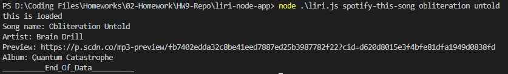
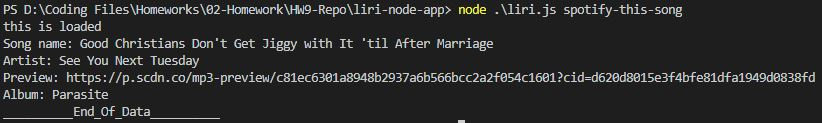
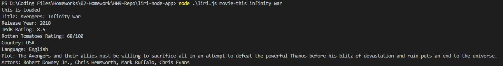
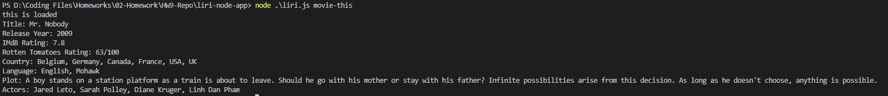
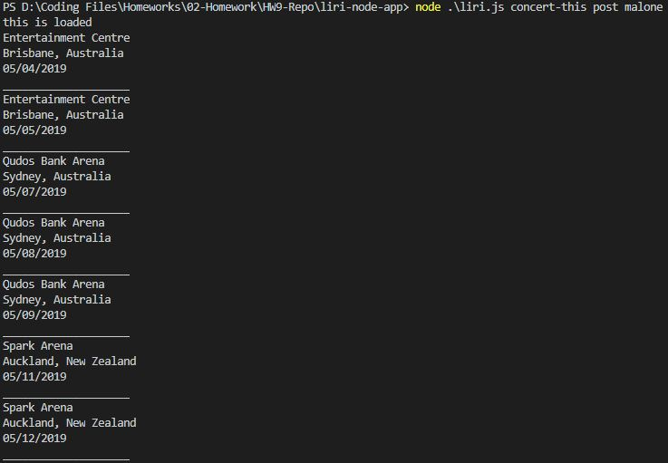
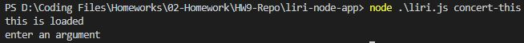

https://aangl3r.github.io/liri-node-app/

***Spotify  
Screenshot of liri.js taking multiple words as input for and returning song information
via the spotify API.  

If no song is given, spotify returns this song "Good Christians Don't Get Jiggy With It
'Til After Marriage"  

***OMDB  
Screenshot of liri.js taking multiple words as an input and logging the information
about the movie to the console.  

Screenshot showing Mr Nobody output when user does not enter a movie name  

***Bands in Town  
Screenshot of liri.js taking multiple words as an input and logging the information
about the artists upcoming shows to the console.  

If no argument is entered, a simple error message is returned  
